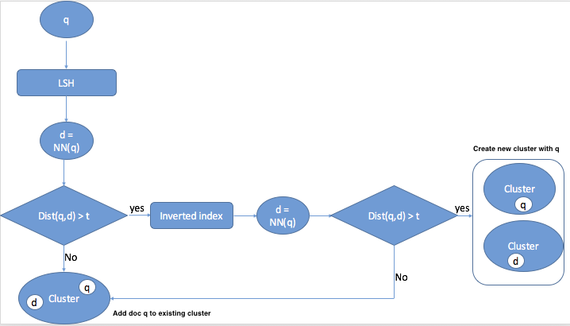

# lsh_clustering

### Document (tweets) clustering based on LSH algorithm

- ***cl_step_1:*** 

```cl_step_1.py``` creates clusters of tweets that are very close each others. In order to improve the performance of the algorithm in terms of 
time, it is based on the LSH algorithm (an algorithm for solving the approximate Near Neighbor Search in high dimensional spaces). In our work we use
the LSH implmentation reported in https://github.com/kayzh/LSHash.
For more details about how the LSH algorithm works see https://www.youtube.com/watch?v=Arni-zkqMBA. If the LSH algorithm is not able to retrieve the 
Nearest Neighbor document, then our algorthm look for the NN in a inverted index structure querying all documents that have some term co-occurrence with
the cuerrent query doc (tweet).

- ***cl_step_2:*** This script analyses the cluster obtained in the previous step grouping together cluster that belong to the same topic (in our 
work a topic is a potential event!). Also in this case the clustering algorithm is based on the LSH algorithm.


- ***Evaluation:*** The above mentioned clustering algorithms were tested with differt distance threshold values between [0.1 - 0.9] with a 
0.1 interval. So, we performed 81 experiments combining all possible threshold values (step_2 threshold with step_1 threshold) . 
To evaluate which distance thresholds combination led to a better clustering results we compute the intra-cluster distance and the 
inter-cluster distance for each clustering result obtained at the step 2 (we only evaluate since step_1 is just an intermediate step). 

The goal is to the best combination of threshold values that at the same time ***minimize the intra-cluster distance*** and ***maximize the inter-cluster distance***. 
Given that Maximize f(x) = minimize -f(x) we want to minimize (intra-cluster + (-inter-cluster)).